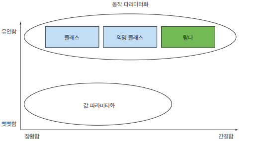

# 동작 파라미터화 코드 전달하기

---
## 동작 파라미터화적
동작 파라미터화란 어떻게 실행할 것인지 결정하지 않은 코드 블록으로 이를 통해 변화하는 요구사항에 유연하게 대응할 수 있다.

## 변화하는 요구사항에 대응

### 녹색사과 필터링
```java
public static List<Apple> filterGreenApples(List<Apple> inventory) {
    List<Apple> result = new ArrayList<>();
    for (Apple apple : inventory) {
        if (apple.getColor() == Color.GREEN) {
            result.add(apple);
        }
    }
    return result;
}
```
만약 필터링할 색이 계속 바뀐다면??
<br><br>                    
### 색을 파라미터화
```java
// 색으로 필터링
public static List<Apple> filterApplesByColor(List<Apple> inventory, Color color) {
    List<Apple> result = new ArrayList<>();
    for (Apple apple : inventory) {
        if (apple.getColor() == color) {
            result.add(apple);
        }
    }
    return result;
}
```

```java
// 무게로 필터링할 경우도 있음
public static List<Apple> filterApplesByWeight(List<Apple> inventory, int weight) {
    List<Apple> result = new ArrayList<>();
    for (Apple apple : inventory) {
        if (apple.getWeight() > weight) {
            result.add(apple);
        }
    }
    return result;
}
```
하지만 위 코드들을 보면 if문 내 조건식만 다르고 나머지코드는 중복된다는 것을 볼 수 있다.

그럼 한번 위 2가지 코드를 합쳐본다면?
<br><br>                    

 ### 가능한 모든 속성으로 필터링
```java
// flag : true -> 색
// flag : false -> 무게
public static List<Apple> filterApples(List<Apple> inventory, Color color, int weight, boolean flag) {
    List<Apple> result = new ArrayList<>();
    for (Apple apple : inventory) {
        if ((flag && apple.getColor().equals(color)) ||
             (!flag && apple.getWeight() > weight)) {
            result.add(apple);
        }
    }
    return result;
}
```
flag의 의미가 한번에 파악이 안되고 필터링 조건을 무게, 색 이외에 크기, 모양같이 다른 조건으로 바꿀 경우 유연하게 대응할 수 없다.
filterApples함수에 어떤 식으로 사과를 필터링할 것인지 효과적으로 전달할 방법은 없을까??
<br>
## 추상적 조건으로 필터링
먼저 선택 조건을 결정하는 인터페이스를 정의해보자.

if문 안의 조건식만 바뀌면 되므로 참 거짓을 반환하는 함수를 만들면 된다.


```java
public interface ApplePredicate {
    boolean test(Apple apple);
}
```
정의한 인터페이스를 이용하여 다양한 필터링 조건을 대표하는 클래스를 만들어보자.
```java
// 무게로 필터링
public class AppleHeavyWeightPredicate implements ApplePredicate {
    public boolean test(Apple apple) {
        return apple.getWeight() > 150;
    }
}

// 초록색으로 필터링
public class AppleGreenColorPredicate implements ApplePredicate {
    public boolean test(Apple apple) {
        return apple.getColor() == Color.GREEN;
    }
}
```

```java

public static List<Apple> filterApples(List<Apple> inventory, ApplePredicate p) {
    List<Apple> result = new ArrayList<>();
    for (Apple apple : inventory) {
        if (p.test(apple)) {
            result.add(apple);
        }
    }
    return result;
}

List<Apple> greenColorApple = filterApples(inventory, new AppleGreenColorPredicate());
```
이제 필요한 조건에 따라 다양한 ApplePredicate를 만들어서 filterApples 메서드로 전달할 수 있다.
filterApples함수에 어떤 ApplePredicate 객체를 전달하느냐에 따라 filterApples메서드의 동작이 결정된다.

하지만 조건 식마다 여러 클래스를 정의하고 인스턴스화 하는 과정이 거추장스럽다.<br>
=> 익명클래스를 이용하자!

## 익명클래스 사용
익명클래스는 클래스 내부의 중첩 클래스이며 클래스 선언과 동시에 인스턴스화할 수 있다는 특징이 있어 일화성으로 딱 하나의 객체가 필요한 경우 사용됩니다.
<br>
<br>
<익명클래스 선언 방법>


일반 클래스는 인터페이스를 제한 없이 상속받을 수 있지만, 익명 클래스는 단 하나의 인터페이스/클래스만을 구현할 수 있다.

```java
// filterApples 메서드 동작을 직접 파라미터화
List<Apple> redApples = filterApples(inventory, new ApplePredicate() {
    public boolean test(Apple a) {
        return RED.equals(apple.getColor());
    }
});
```

하지만 익명 클래스를사용하면 코드가 장황해지고 유지보수하는데 오랜 시간이 걸린다.

람다 표현식이라는 더 간단한 코드 전달 기법을 도입하자!
```java
List<Apple> result = filterApples(inventory, (Apple apple) -> RED.equals(apple.getColor()));
```

---
## 중간정리
지금까지 살펴본 내용을 정리하자.<br>


## 리스트 형식으로 추상화
만약 사과만 필터링 하는 게 아니고 바나나, 딸기도 각각 필터링 하고 싶다면 어떻게 해야할까.
추상화하자!!
```java
public interface Predicate<T> {
    booelan test(T t);
}

public static <T> List<T> filter(List<T> list, Predicate<T> p) {
    List<T> result = new ArrayList<>();
    for (T e : list) {
        if(p.test(e)) {
            result.add(e);
        }
    }
    return result;
}

List<Banana> YellowBanana = filter(inventory, (Banana banana) -> YELLOW.equals(banana.getColor()));
```

---
## 함수형 인터페이스
함수형 인터페이스란 1개의 추상 메소드를 갖고 있는 인터페이스를 말한다.

그래서 이를 강제하기 위해 밑과 같은 `@FunctionalInteface` 같은 어노테이션도 존재한다.
