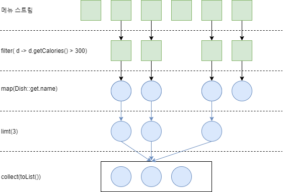

# 4. 스트림 소개

---
## 4.1 스트림이란 무엇인가?

### 스트림
-  자바8 API에 새로 추가된 기능
- 선언형으로 컬렉션 데이터를 처리할 수 있음
- 멀티스레드 코드를 구현하지 않아도 데이터를 투명하게 병렬로 처리 가능


### [java7] 저칼로리의 요리명을 반환하고, 칼로리를 기준으로 요리를 정렬하는 코드 
```java
List<Dish> lowCaloricDishes = new ArrayList<>();

for(Dish dish: menu) {
    if(dish.getCalories() < 300) {
        lowCaloricDishes.add(dish);
    }
}

Collections.sort(lowCaloricDishes, new Comparator<Dish>() {
    public int compare(Dish dish1, Dish dish2) {
        return Integer.compare(dish.getCalories(), dish2.getCalories());
    }
});

List<String> lowCaloricDishesName = new ArrayList<>();

for(Dish dish: lowCaloricDishes) {
    lowCaloricDishesName.add(dish.getName());
}
```
-> lowCaloricDishes라는 '가비지 변수'를 사용
### [java8] 스트림 이용
```java
/*
 * stream() 대신 parallelStream()을 이용하면
 * 멀티코어 아키텍처에서 병렬로 실행
 */

List<String> lowCaloricDishesName = menu.stream() 
                                        .filter(d -> d.getCalories() < 300)
                                        .sorted(comparing(Dish::getCalories))										
                                        .map(Dish::getName)
                                        .collect(toList());
```

자바 8의 스트림 API의 특징을 다음처럼 요약할 수 있다.

> 선언형 : 더 간결하고 가독성이 좋아진다. <br>
>조립할 수 있음 : 유연성이 좋아진다.<br>
병렬화 : 성능이 좋아진다.

---
## 4.2 스트림 시작하기
스트림 :**_데이터 처리 연산_** 을 지원하도록 **_소스_** 에서 추출된 **_연속된 요소_**

- 연속된 요소
: 컬렉션과 마찬가지로 스트림은 특정 요소 형식으로 이루어진 연속된 값 집합의 인터페이스를 제공한다.
컬렉션은 자료구조이므로 시간과 공간의 복잡성과 관련된 요소 저장 및 접근 연산이 주를 이루는 반면, 스트림은 filter, sorted, map처럼 표현 계산식이 주를 이룬다. 즉, 컬렉션의 주제는 데이터이고 스트림의 주제는 계산이다.

- 소스
: 스트림은 컬렉션, 배열, I/O 자원 등의 데이터 제공 소스로부터 데이터를 소비한다. 정렬된 컬렉션으로 스트림을 생성하면 정렬이 그대로 유지된다.

- 데이터 처리 연산
: 스트림은 함수형 프로그래밍 언어나 데이터베이스에서 지원하는 연산과 비슷한 연산을 지원한다. 스트림 연산은 순차적 또는 병렬로 실행할 수 있다.


### 스트림의 중요한 특징 2가지

- 파이프라이닝
: 대부분의 스트림 연산은 스트림 연산끼리 연결해서 커다란 파이프 라인을 구성할 수 있도록 스트림 자산을 반환한다. 그덕분에 게으름(jaziness), 쇼트서킷(short circuiting) 같은 최적화도 얻을 수 있다.

- 내부 반복
  : 반복자를 이용해서 명시적으로 반복하는 컬렉션과 달리 스트림은 내부 반복을 지원한다.

```java
List<String> treeHighCaloricDishesName = 
  menu.stream() // 메뉴에서 스트림을 얻는다.
    .filter(d -> d.getCalories() > 300) // 파이프라인 연산 만들기(고칼로리 요리 필터링)
    .map(Dish::getName) // 요리명 추출
    .limit(3) // 선착순 세 개만 선택
    .collect(toList()); // 결과를 다른 리스트로 저장
```
- filter : 람다를 인수로 받아 스트림에서 특정 요소를 제외시킨다. 
- map : 람다를 이용해서 한 요소를 다른 요로소 변환하거나 정보를 추출한다. 
- limit : 정해준 개수 이상의 요소가 스트리에 저장되지 못하게 스트림 크기를 축소 truncate 한다. 
- collect : 다양한 변환 방법을 인수로 받아 스트림에 누적된 요소를 특정 결과로(다른 형식으로) 변환한다.


---
## 4.3 스트림과 컬렉션
컬렉션과 스트림 모두 연속된 형식의 값을 저장하는 자료구조의 인터페이스를 제공한다.
여기서 '연속된'이라는 표현은 순서와 상관없이 아무 값에나 접속할 수 있는 것이 아니라 순차적으로 값에 접근한다는 의미이다.

컬렉션과 스트림의 가장 큰 차이는 **데이터를 언제 계산하느냐**이다.
컬렉션은 현재 자료구조가 포함하는 모든 값을 메모리에 저장하는 자료구조다.
컬렉션에 요소를 추가하거나 제거할 수 있으며, 컬렉션의 모든 요소는 컬렉션에 추가하기 전에 계산되어야 한다.

반면 스트림은 이론적으로 요청할 때만 요소를 계산하는 고정된 자료구조다.
스트림에는 요소를 추가하거나 제거할 수 없다. 결과적으로 스트림은 생산자와 소비자 관계를 형성한다.

###  외부 반복과 내부 반복

- 외부 반복
: 컬렉션 인터페이스를 사용하려면 for-each 등을 사용해서 사용자가 직접 요소를 반복. 병렬성을 스스로 관리(synchronized 사용)해야 한다.

- 내부 반복
: 스트림 라이브러리는 반복을 알아서 처리하고 결과 스트림값을 어딘가에 저장. 
  내부 반복을 사용하면 작업을 투명하게 병렬적으로 처리하거나 최적화된 다양한 순서로 처리가 가능하다.

---
## 4.4 스트림 연산

- 중간 연산
: 연결할 수 있는 스트림 연산으로 다른 스트림을 반환하고 게으르다는 특징이 있다. <br>filter, map, limit,  ...

- 최종 연산
: 스트림을 닫는 연산으로 스트림 파이프라인에서 결과를 도출한다. <br>collect, forEach, count, ...

