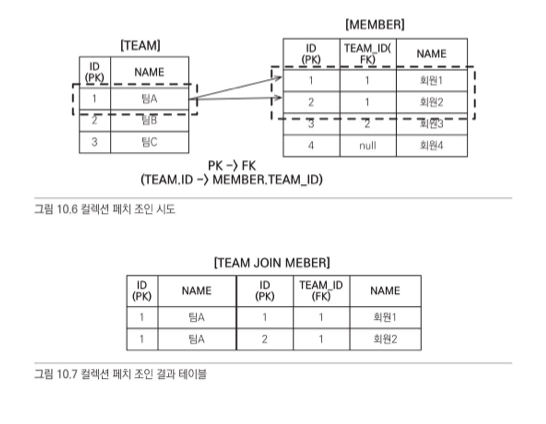
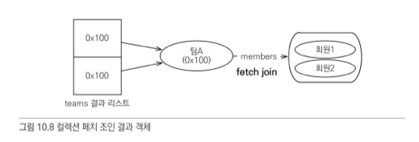
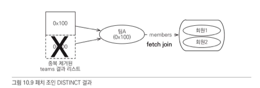

# JPQL
---
JPQL은 테이블이 아닌 엔티티 객체를 조회하는 객체지향 쿼리이며, SQL을 추상화하여 데이터베이스에 의존적이지 않다.

<br></br>

# JPQL 문법
---
`SELECT`, `UPDATE`, `DELETE` 문을 사용하고 `INSERT`는 persist() 메소드를 사용하면 되므로 없다.

<br></br>

## **SELECT**

대소문자 구분
- 엔티티와 속성은 대소문자를 구분하며, SQL 키워드는 구분하지 않는다.

<br></br>

엔티티 이름
- JPQL에서는 클래스 명이 아니라 `엔티티 명`을 사용한다. 이 엔티티 명은 `@Entity(name = "xx")`로 정할 수 있고 디폴트 값은 클래스 명으로 저장이 된다.

<br></br>

별칭<br></br>
```
SELECT username FROM Member m
```
은 잘못된 문법이다. username -> m.username으로 수정해야 된다.

<br></br>


## TypeQuery, Query

TypeQuery와 Query는 JPQL을 실행하기 위한 쿼리 객체다. JPQL 실행 결과 리런 타입이 명확하면 TypeQuery, 그렇지 않으면 Query를 사용한다.
- TypeQuery로 받는다면 타입을 변환할 필요가 없기 때문에 좋다.

<br></br>

## 파라미터 바인딩

이름 기준 파라미터
- `:` 키워드를 파라미터 앞에 붙여서 구분한다.

```java
TypeQuery<Member> query = em.createQuery("SELECT m FROM Member m where m.username = :username", Member.class);

query.setParameter("username", usernameParam);
List<Member> resultList = query.getResultList();
```

<br></br>

위치 기준 파라미터
- 위치 기준 파라미터는 `?` 다음에 위치 값을 주면된다.

```java
List<Member> members = em.createQuery("SELECT m FROM Member m where m.username = ?1", Member.class)
                        .setParameter(1, usernameParam)
                        .getResultList();
```

## 프로젝션

프로젝션은 조회할 대상을 지정하는 것을 말한다.

엔티티 프로젝션
- 엔티티 프로젝션은 `SELECT m FROM Member m`처럼 엔티티 객체를 바로 조회하는 것을 말하는데, 엔티티를 조회하면 영속성 컨텍스트에서 관리된다.

<br></br>

임베디드 타입 프로젝션
- 임베디드 타입은 하나의 엔티티에서 사용되는 속성이므로 바로 조회할 수 없다. 해당 임베디드 타입을 사용하는 엔티티를 불러온 후, 조회 가능
- 엔티티가 아니고 값타입이기 때문에 영속성 컨텍스트에서 관리 x

<br></br>

스칼라 타입 프로젝션
- 숫자, 문자, 날짜와 같은 기본 데이터를 스칼라 타입이라고 한다.

<br></br>

여러 값 조회
- 엔티티를 대상으로 조회하지 않고, 필요한 데이터만 조회할 때는 TypeQuery말고 Query를 사용해야 한다.

<br></br>

NEW 명령어
- 실무에선 DTO로 의미 있는 객체로 변환하여 사용한다.

```java
List<Object[]> resultList = em.createQuery("SELECT m.username, m.age FROM Member m")
                            .getResultList();

// 객체 변환 작업
List<UserDTO> userDTOs = new ArrayList<UserDTO>();
~~~~~~~~~~ 
```

위 작업을 new 연산자를 사용하게 되면,

```java
TypeQuery<UserDTO> query = em.createQuery("SELECT new jpabook.jpql.UserDTO(m.username, m.age) FROM Member m", UserDTO.class);
List<UserDTO> resultList = query.getResultList();
```

다음과 같이 지루한 작업들을 없앨 수 있다.

<br></br>

## 페이징 API

생략. JPQL이 방언에 맞춰 SQL 변환 함.

## 집합과 정렬

생략. 단순 문법

## 세타 조인

세타 조인은 관계가 없는 엔티티간에도 여러 가지 다양한 조건으로 조회하는 것을 말한다.
- `=,≠,≥,≤,>,<`를 사용할 수 있음

<br></br>

## 페치 조인

페치 조인은 연관된 엔티티나 컬렉션을 한 번에 같이 조회하는 것을 말하며 `join fetch` 명령어를 통해 사용 가능하다.

```java
select m from Member m join fetch m.team
```

- 특징으로 다른 JPQL 조인과 다르게 조인 대상에 별칭을 사용할 수 없다.
- 페치 조인을 사용하면 지연로딩으로 설정되어 있어도 프록시가 아닌 실제 엔티티가 조회된다.

<br></br>

## 컬렉션 페치 조인

```java
select t from Team t join fetch t.members where t.name = '팀A'
```





페치 조인을 한 다음, 조회를 하게 되므로 조인된 데이터의 갯수만큼 추가적으로 조회를 하게 된다.
- 일대다 조인은 결과가 증가하지만, 다대일 조인은 결과가 증가하지 않음.

<br></br>

## 페치 조인과 DISTINCT

위에 본 것처럼 페치 조인을 하게 되면 중복 데이터를 조회하게 되므로, DISTINCT를 사용해 중복을 제거할 수 있다.
- 페치 조인이 되어 증가된 만큼 추가적으로 조회할 때의 중복을 없애줌.



`페치 조인은 연관된 엔티티도 함께 조회하는 반면, 일반 조인은 연관된 엔티티는 조회하지 않는다.`

<br></br>

## 페치 조인의 이점과 한계

페치 조인은 연관된 엔티티들을 함께 조회할 수 있기 때문에 SQL 호출 횟수를 줄여서 성능을 최적화할 수 있다.
- 즉시로딩으로 설정하게 되면, 사용 빈도가 낮은 엔티티들도 항상 불러오기 때문에 오히려 성능 저하가 발생할 수 있으므로 지연 로딩을 디폴트로 하고 필요한 경우에 페치 조인을 적용하자.

한계는 아래와 같다.
1. 페치 조인 대상에는 별칭을 줄 수 없다.
2. 둘 이상의 컬렉션을 페치할 수 없다.
3. 컬렉션을 페치 조인하면 페이징 API를 사용할 수 없다.

<br></br>

## 경로 표현식

경로 표현식은 `.`을 사용해서 객체 그래프를 탐색하는 것을 말한다.

```
select m.username from Member m
join m.team t
join m.orders o
where t,name = '팀A'
```

위 코드에서 m.username m.team 등이 경로 표현식의 예시다.

<br></br>

## 경로 표현식 용어

1. 상태 필드: 단순 값을 저장하기 위한 필드
    - 하나의 엔티티의 변수값이므로 더이상 탐색할 수 없다.
2. 연관 필드: 연관관계를 위한 필드(임베디드 타입 포함)
    - 연관관계를 맺은 엔티티 값이므로 해당 엔티티를 추가적으로 탐색할 수 있다.
    - 단일 값은 계속 탐색 가능
    - 컬렉션 값은 조인 대상의 별칭을 정해주면 탐색 가능

`여기서 연관 필드를 경로 탐색하는 경우, 직접 Join문을 작성하지 않아도 내부 조인이 발생하는데 이것을 `***묵시적 조인***`이라고 한다.` 

<br></br>

## COALESCE

엔티티가 Null이면 직접 설정해놓은 이름을 반환

```
select coalesce(m.username, '이름 없는 회원') from Member m
```

<br></br>

## 다형성 쿼리

JPQL로 부모 엔티티를 조회하면 자식 엔티티도 함께 조회된다.

<br></br>

### 단위테이블 전략(InheritanceType.SINGLE_TALBE)
- 모든 타입을 조인해서 가져옴

<br></br>

### Type
```
select i from Item i
where type(i) IN (Book, Movie)
```
- 특정 타입만 가져옴

<br></br>

### TREAT
```
select i from Item i
where treat(i as Book).author = 'kim'
```
- 부모 타입을 자식 타입으로 다룰 수 있음

<br></br>

## Named 쿼리: 정적 쿼리

<br></br>

# QueryDSL
---
JPQL 빌더 역할을 하고 Criteria의 복잡하다는 단점을 없앨 수 있는 오픈소스 프로젝트다.

QueryDSL을 사용하기 위해서는 엔티티를 기반으로 쿼리 타입이라는 쿼리용 클래스를 생성해야 한다.

<br></br>

<br></br>

## 기본 Q 생성

```java
QMember qmember = QMember.member;
```
보통 위와 같이 기본 인스턴스를 불러서 사용하는데 

```java
QMember admin = QMember.member;
Qmember target = Qmember.member;
```
이렇게, 사용해서 조인하는 경우엔 같은 결과물이 나오기 때문에

```java
QMember admin = new QMember("admin");
Qmember target = new QMember("target");
```
이런 식으로 직접 지정해주도록 한다.

<br></br>

## 검색 조건 쿼리

```java
JPAQuery query = new JPAQuery(em);
QItem item = QItem.item;
List<Item> list = query.from(item)
            .where(item.name.eq("좋은상품").and(item.price.gt(20000)))
            .list(item);
```

<br></br>

## 결과 조회

1. UniquerResult(): 조회 결과가 한건일때, 하나 이상이면 예외 발생
2. singleResult(): 결과가 하나 이상이면, 맨 처음 데이터 반환
3. list(): 결과가 하나 이상일 때 사용

<br></br>

## 페이징과 정렬

```java
JPAQuery query = new JPAQuery(em);
QItem item = QItem.item;
List<Item> list = query.from(item)
            .where(item.price.gt(20000))
            .orderBy(item.price.desc(), item.stockQuantity.asc())
            .offset(10).limit(20)
            .list(item);
```

실제로 페이징을 하게 되면 총 데이터 개수를 알아야 한다. 그때는 listResults()를 사용해주면 되고 데이터 조회 시, 카운트 쿼리가 추가로 나간다.
- 하지만 데이터가 무수히 많아지면 데이터 조회시마다 카운트 쿼리를 하게되면 성능적으로 이슈가 있다.

<br></br>

## 서브 쿼리

```java
QItem item = QItem.item;
QItem itemSub = new QItem("itemSub");

query.from(item)
    .where(item.price.eq(
        new JPASubQuery().from(itemSub).unique(itemSub.price.max()) // 서브 쿼리 결과가 1개면 unique(), 여러 개면 list()
    ))
    .list(item)
```

<br></br>

## 프로젝션
프로젝션은 select 절에 조회 대상을 지정하는 것을 말한다.

방법이 총 3가지가 있다.

#### 프로퍼티 접근

```java
QItem item = QItem.item;
List<ItemDTO> result = query.from(item).list(
    Projections.bean(ItemDTO.class, item.name.as("username"), item.price));
```

위 코드에서, Projections.bean은 `setter`를 사용해서 값을 설정하며, DTO와 필드명이 다를 경우 별칭을 사용해서 값을 맞춰준다.

<br></br>

#### 필드 직접 접근

```java
QItem item = QItem.item;
List<ItemDTO> result = query.from(item).list(
    Projections.fields(ItemDTO.class, item.name.as("username"), item.price));
```

<br></br>

#### 생성자 사용

```java
QItem item = QItem.item;
List<ItemDTO> result = query.from(item).list(
    Projections.constructor(ItemDTO.class, item.name, item.price));
```

<br></br>

## 수정, 삭제 배치 쿼리

```java
QItem item = QItem.item;
JPAUpdateClause updateClause = new JPAUpdateClause(em, item);
long count = updateClause.where(item.name.eq("시골개발자의 JPA 책"))
    .set(item.price, item.price.add(100))
    .excute();

QItem item = QItem.item;
JPADeleteClause deleteClause = new JPADeleteClause(em, item);
long count = deleteClause.where(item.name.eq("시골개발자의 JPA 책"))
    .excute();
```

<br></br>

## 동적 쿼리

특정 조건을 만족할 시 동적으로 쿼리를 생성할 수 있다.

```java
BooleanBuilder builder = new BooleanBuilder();
if (StringUtils.hasText(param.getName())) {
    builder.and(item.name.contains(param.getName()));
}
if (param.getPrice() != null) {
    builder.and(item.price.gt(param.getPrice()));
}
List<Item> result = query.from(item)
        .where(builder)
        .list(item);
```

<br></br>

## 메소드 위임

쿼리 타입에 검색 조건을 직접 정의할 수 있다.

```java
public class ItemExpression {

    @QueryDelegate(Item.class)
    public static BooleanExpression isExpensive(QItem item, Integer price) {
        return item.price.gt(price);
    }
}

public class QItem extends EntityPathBase<Item> {

    public com.mysema.query.types.expr.BooleanExpression
        isExpensive(Integer price) {
            return ItemExpression.isExpensive(this, price);
        }
}
```

<br></br>

# 네이티브 SQL
---
JPQL은 SQL이 지원하는 대부분의 문법과 함수를 지원하지만 특정 데이터베이스에 종속적인 기능은 지원하지 않는다.
- 특정 데이터베이스만 지원하는 함수, 문법, SQL 쿼리 힌트
- 인라인 큐, UNION,INTERSECT
- 스토어드 프로시져