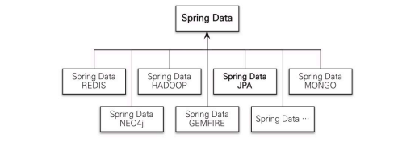
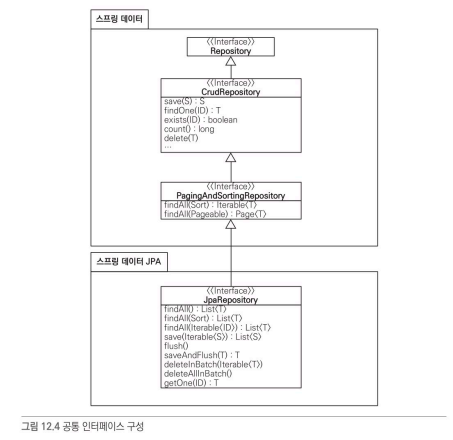

# 스프링 데이터 JPA
---
> 스프링 데이터 JPA는 데이터 접근 계층을 개발할 때 구현 클래스 없이 인터페이스만 작성하여 CRUD 개발을 할 수 있는 스프링 데이터 프로젝트이 하위 프로젝트다.



```java
public interface MemberRepository extends JpaRepositroy<Member, Long> {
    Member findByUsername(String username);
}
```
일반적인 CRUD는 작성할 필요 없지만 위의 코드처럼 공통적이지 않은 메소드까지 처리할 수 있고 위의 메소드를
```sql
select m from Member m where username =:username
```
으로 해석한다.

<br></br>

# 공통 인터페이스 기능
---



위의 그림처럼 JpaRepsitory를 상속받으면 스프링 데이터가 제공하는 기능뿐 아니라, 추가적인 기능들을 사용할 수 있다.

추가 기능들 `T는 엔티티, ID는 식별자 타입, S는 엔티티와 자식 타입`

1. save(S): 새로운 엔티티는 저장하고, 이미 있으면 수정
2. delete(T): EntityManager.remove() 호출
3. findOne(ID): EntityManager.find() 호출
4. getOne(ID): EntityManager.getReference() 호출
5. findAll()

<br></br>

# 쿼리 메소드
---

쿼리 메소드 기능은 메소드를 선언하면 스프링 데이터 JPA가 알맞은 JPQL 쿼리를 만들어낸다.

### 메소드 이름으로 쿼리 생성
- 문법에 맞춰 메소드만 설정해주면 됨

### 메소드 이름으로 JPA NamedQuery 호출
- 애노테이션이나 XML에 쿼리를 정의하는 것을 말하는데 정의한 쿼리에 이름을 부여할 수 있다.

```java
@Entity
@NamedQuery (
    name = "Member.findByUsername",
    query = "select m from Member m where m.username =:username")
public class Member {

}

// 호출
List<Mebmer> resultList = em.createNamedQuery("Member.findByUsername", Member.class)
                            .setParameter("username", "회원1")
                            .getResultList();
```

3. @Query 애노테이션을 사용해서 직접 정의
- 레포지토리 인터페이스에서 `@Query`을 사용하여 원하는 SQL문을 작성할 수 있다.
- Option으로 nativeQuery가 있는데 true면 JPQL, false면 SQL이다.

<br></br>

### 파라미터 바인딩
파라미터 바인딩은 총 두가지의 방법이 존재한다.
1. 위치 기반
```sql
select m from Member m where m.username = ?1
```
2. 이름 기반
```sql
select m from Member m where m.username = :name
```

**`가독성을 위해 이름 기반으로 사용하도록 하자`**

<br></br>

# 사용자 정의 레포지토리 구현
---
스프링 데이터 JPA로 레포지토리를 만들면 인터페이스만 정의하고 구현체는 만들지 않는다. 여기서 공통 인터페이스를 사용하면서, 추가로 사용자가 필요로 하는 메소드를 추가적으로 구현할 수 있는 방법이 있다.

```java
// 사용자 정의 인터페이스
public interface MemberRepositoryCustom {
    public List<Member> findMemberCustom();
}

// 사용자 정의 구현 클래스
public class MemberRepositoryImpl implements MemberRepositoryCustom {

    @Override
    public List<Member> findMemberCustom() {
        ...
    }
}

// 스프링 데이터 JPA, 사용자 정의 인터페이스 모두 상속
public interface MemberRepository extends JpaRepository<Member, Long>, MemberRepositoryCustom {

}
```

<br></br>

# 스프링 데이터 JPA가 사용하는 구현체
---
스프링 데이터 JPA가 제공하는 공통 인터페이스는 `SimpleJpaRepository` 클래스가 구현한다.
- 서비스 단에서 트랜잭션 시작하면 레포지토리까지 전파됨
- 서비스 단에서 트랜잭션 시작하지 않아도 레포지토리단에서 시작되긴 함


# JPA와 QueryDsl 사용
---
gradle에 추가하는게 나아보인다.