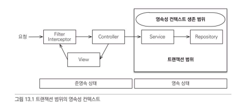
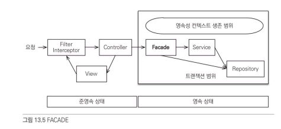
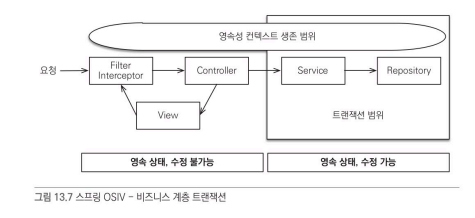

# 스프링 컨테이너의 기본 전략
---
스프링 컨테이너는 트랜잭션 범위의 영속성 컨텍스트 전략을 기본으로 사용한다. 따라서 트랜잭션이 시작할 때, 영속성 컨텍스트를 생성하고 트랙잭션이 끝날 때, 영속성 컨텍스트를 종료한다.



보통 서비스단에서 트랜잭션이 시작하는데 `@Transactional`이 있으면 트랜잭션 AOP가 먼저 동작을 하게 된다. 그 다음 해당 메소드가 종료될 때 영속성 컨텍스트를 플러시해서 변경 내용을 반영한 후에 트랜잭션을 커밋한다.


트랜잭션이 같으면 같은 영속성 컨텍스트를 사용하며, 만약 트랜잭션이 달라도 영속성 컨텍스트가 다르기 때문에 ***`멀티 스레드 상황을 컨테이너가 처리`***해준다.

<br></br>

# 준영속 상태와 지연 로딩, 변경 감지
---
영속성 컨텍스트에서 관리가 되지 않게 되면 준영속 상태가 되는데 이 때, <span style="color: red">지연 로딩</span>이 동작하지 않는다. 따라서 컨트롤러 단에서는 준영속 상태이기 때문에 지연 로딩이 동작하지 않으므로 예외가 발생하게 된다.
- 지연 로딩은 뷰단에서 연관 엔티티도 같이 사용될 상황이 많아서 문제 발생 시, 해결해야 된다.

<br></br>

변경 감지 또한 영속성 컨텍스트로 관리될 때, 동작하기 때문에 영속성 컨텍스트가 종료된 컨트롤러나 뷰단에서는 동작하지 않는다.
- 변경 감지는 컨트롤러나 뷰 단에서 작동할 필요가 없다.

### 지연 로딩 해결 방법

글로벌 패치 전략
- 패치 전략을 지연 로딩에서 즉시 로딩으로 변경하는 것을 말한다. 하지만 즉시 로딩으로 바꾸게 되면 필요 하지 않은 엔티티라고 할지라도 항상 가져오고, `N + 1`문제가 발생한다.

JPQL 페치 조인
- JPQL은 호출 시점에 함께 로딩할 엔티티를 설정할 수 있다.
```JPQL
select o
from Order o
join fetch o.member
```

프록시 강제 초기화
- 서비스 단에서 프록시 객체를 가져온 다음, 바로 get메소드를 사용하여 프록시 객체의 실제값을 호출하게 되면 실제 엔티티가 불러져서 강제로 초기화가 가능하다.

하지만, 서비스단에서 프록시 초기화 역할까지 맡는 것보다는 비즈니스 로직만을 담당하는게 낫다. 따라서 컨트롤러와 서비스단 사이에 <span style="color: red">FACADE</span>라는 계층을 하나 더 만들어준다.



FACADE계층은 컨트롤러나 뷰 단을 위해 프록시를 초기화 하는 역할을 하여 서비스 단과 컨트롤러 단의 의존성을 없앨 수 있다.

# FACADE 계층의 역할
---
1. 컨트롤러 계층과 도메인 모델 계층 간의 논리적 의존성을 분리해준다.
2. 컨트롤러 계층에서 필요한 프록시 객체를 초기화한다.
3. 서비스 계층을 호출에서 비즈니스 로직을 실행한다.
4. 레포지토리를 직접 호출해서 뷰가 요구하는 엔티티를 찾을 수 있다.

<br></br>

# OSIV(Open Session in View)
---
OSIV는 영속성 컨텍스트를 컨트롤러, 뷰 계층까지 열어둔다는 뜻이다.

기존에는 요청 당 트랜잭션 방식을 사용했는데 이 방식은 요청이 들어오자마자 필터나 인터셉터에서 바로 트랜잭션을 실행하는 것을 말한다. 하지만 이 방식은 컨트롤러나 뷰 계층에서 엔티티 변경이 가능하다는 문제점이 있다.

이 문제점을 해결하기 위해 몇 가지 방식이 있다.

1. 엔티티를 읽기 전용 인터페이스로 제공
2. 엔티티 레핑
3. DTO만 반환

하지만 위의 방법들 모두 컨트롤러, 뷰 단에서 수정이 된다는 점 때문에 사용하기가 꺼려지고 있다. 이것을 보완하기 위해 다음과 같은 아키텍처 구조의 스프링 OSIV를 사용한다.



동작 과정은 다음과 같다.
1. 클라이언트의 요청이 들어오면 서블릿 필터나, 스프링 인터셉터에서 영속성 컨텍스트를 생성한다. `단 트랜잭션은 시작하지 않는다`
2. 서비스 단에서 @Transactional로 시작할 때, 1번에서 미리 생성해둔 영속성 컨텍스트를 찾아와서 트랜잭션을 시작한다.
3. 서비드 단이 끝나면 트랜잭션을 커밋하고 영속성 컨텍스트를 플러시한다. 하지만 여기서 영속성 컨텍스트를 종료하지는 않는다.
4. 컨트롤러와 뷰 단가지 영속성 컨텍스트가 유지되므로 조회한 엔티티는 영속 상태 유지
5. 서블릿 필터나 스프링 인터셉터로 요청이 들어오면 영속성 컨텍스트를 종료한다. `이 때, 수정을 방지하기 위해 플러시를 호출하지 않고 바로 종료`

> 결론적으로 트랜잭션 없이 읽기를 지원하여 컨트롤러나 뷰 단에서도 엔티티를 읽을 수 있으며, 변경한다고 해도 영속성 컨텍스트를 플러시 하지 않을뿐더러 개발자가 임의로 플러시를 하더라도 트랜잭션 밖이므로 예외가 발생한다.