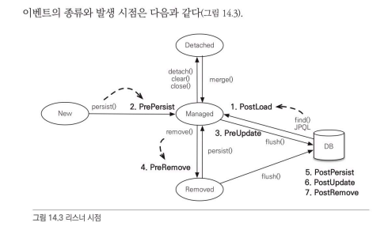

# 컬렉션
---
일대다, 다대다 엔티티 관계를 매핑할 때 사용한다.

컬렉션 인터페이스에 3가지가 있다.
1. Collection, List
2. Set
3. List + @OrderColumn

1번은 중복 엔티티가 있는지 확인하지 않고 단순 저장만 하므로 지연 로딩된 컬렉션을 초기화하지 않지만, 2번은 비교를 해야하기 때문에 지연 로딩된 컬렉션(프록시)을 초기화한다.

3번은 추가적인 위치를 알아내기 위해 Update쿼리가 발생하고, 중간 데이터를 지워버리면 중간에 순서값이 null이 되므로 NPE가 발생한다. 이런 이유 때문에 거의 사용되지 않는다.
- 대안으로 `@OrderBy`를 사용하자.

<br></br>

# @Converter
---
컨버터는 엔티티의 데이터를 변환해서 데이터베이스에 저장하는 것을 말한다. 예를 들어 하나의 엔티티가 저장될 때, 어떤 필드 값이 true or false라면 이것을 다른 것으로 변환시켜서 저장할 수 있다.

```java
@Entity
public class Member {

    @Id
    private String id;
    private String username;

    @Convert(converter=BooleanToYNConvert.class)
    private boolean vip;
}

@Converter
public class BooleanToYNConverter implements AttributeConverter<Boolean, String> {

    @Override
    public String convertToDatabaseColumn(Boolean attribute) {
        return (attribute != null && attribute) ? "Y" : "N";
    }

    @Override
    public Boolean convertToEntityAttribute(String dbData) {
        return "Y".equals(dbData);
    }
}
```

<br></br>

# 리스너
---



이벤트 적용 위치는 몇 가지가 있다.

`엔티티에 직접 적용`
- 클래스 내부에 직접 에노테이션을 지정해서 등록해주면 이벤트가 발생할 때마다 지정된 메소드가 실행됨

<br></br>

`별도의 리스너 등록`
- 리스너 클래스를 생성하고 `@EntityListners()`을 클래스에 적용시켜준다.

<br></br>

`기본 리스너 사용`